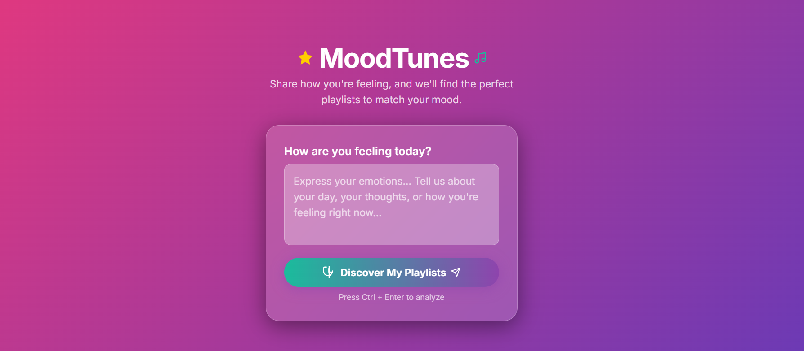

🎶 MoodTunes

Turn emotions into personalized Spotify playlists using AI

MoodTunes is an AI-powered web application that analyzes a user's text, detects their emotion, and recommends a curated Spotify playlist based on that emotion.
Built with FastAPI, PyTorch NLP model, and Spotify Web API, this project combines machine learning with real-time music personalization.

# Features
    User enters text (e.g., “I had a great day!”)

    PyTorch model predicts emotions like:
    happy, sad, angry, calm, excited, neutral, etc.

    The detected emotion becomes a playlist search query

    Uses Spotify API (Client Credentials Flow)

    Returns curated playlist info (name, URL, image)

# install all dependencies 
    cd backend
    pip install -r requirements.txt

# run uvicorn server
    uvicorn main:app --reload

# run frontend
    Open the index.html file in browser or serve it using:
    python -m http.server